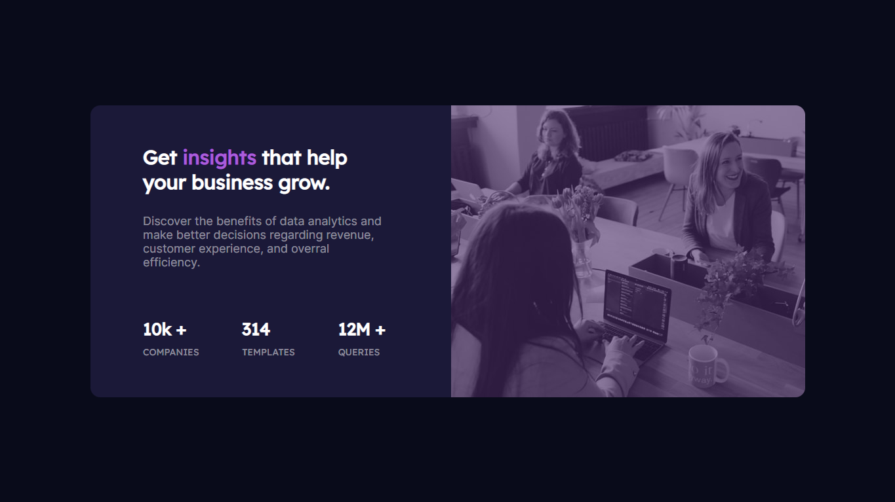

# Desafio Landing Page - Frontend-Mentor

Este é um desafio de uma página de marketing referente a uma empresa que trabalha com análise de dados proposto pelo site Frontend-Mentor.

## Tabela de Conteúdos

- [Visão Geral](#visão-geral)
    - [Imagens](#imagens)
    - [Link da página](#link)
- [Processo](#processo)
    - [Linguagens utilizadas](#linguagens-utilizadas)
    - [O que aprendi](#o-que-aprendi)
    - [Possíveis evoluções](#possíveis-evoluções)
- [Autor](#autor)

## Visão-geral

### Imagens

<br>

````
Versão de Desktop
````

   

<br>

````
Versão Mobile
````

 

### Link

- Página no GitHub Pages: <a href="https://julio-mansan2.github.io/marketing-empresa-analise-de-dados/">Clique aqui!</a>

## Processo

### Linguagens utilizadas

<br>

- Marcações semânticas de HTML5
- Propriedades de customização do CSS3

<br>

### O que aprendi

<br>

- Colocar cores numa imagem

````css

img {

    filter: opacity(0.4) drop-shadow(0 0 0 hsl(277, 64%, 61%));

}

````

<br>

- Utilizar o text-transform

````css

p {

    text-transform: uppercase;

} 

````
<br>

- Utilizar imagens diferentes em divergentes resoluções, utilizando display none

````html

 


````

````css

.image-mobile {

    display: none;

}

@media (max-width: 1200px) {

    .image-mobile {

        display: block;

    }

}

````
<br>

### Possíveis evoluções

<br>

- Otimizar o responsivo;
- Medições melhores;
- Utilizar a tag "source".

<br>

## Autor

GitHub - <a href="https://github.com/julio-mansan2">julio-mansan2</a> <br>
Front-end Mentor - <a href="https://www.frontendmentor.io/profile/julio-mansan2">julio-mansan2</a> <br>